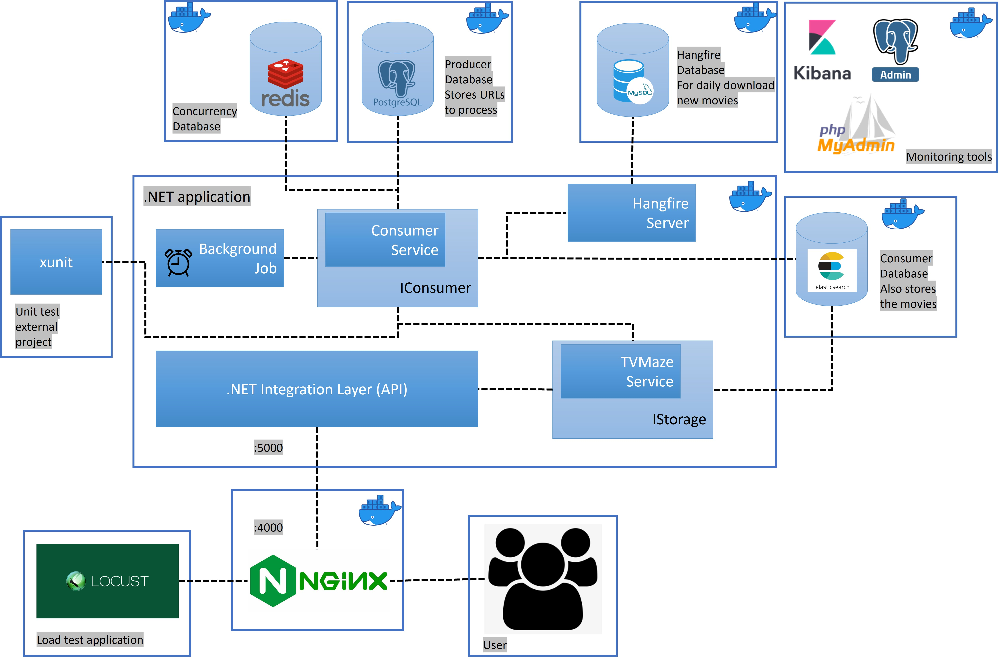

# tvmaze-scraper


This app is about scraping data from the TVMaze API, persisting it in storage, and providing it through a REST API that meets specific business requirements. The data being scraped includes TV show and cast information, and the REST API provides a paginated list of all TV shows with the show ID and a list of cast members ordered by birthday in descending order. The app is designed to provide a convenient way for users to access TV show and cast information from the TVMaze database.

# Pre-requisites
To build and run this app locally you will need a few things:
- docker-compose: to run the application
- Node: to run the script for migrating the database and setting up elastic
- .NET Core (minimum version 6): to run the unit test
- Python 3 (minimum version 3.7): to run the load test application
- Postman (or alternative) 

# Getting started (running the application)
- Clone the repository
```
git clone https://github.com/mabbadi/tvmaze-scraper
```
- Install dependencies
```
cd tvmaze-scraper
npm install
```
- Setup databases
```
npm run es-update
npm run db-migrate
```
- Start the application using Docker Compose. Note --scale which will spaw (N) backend instances of .NET to handle higher load of requests.
```
docker-compose up --build --scale backend=2
```
- Note the application when it starts contains no data and no URLs to process. A hangfire job is scheduled at midnight to download the deltas of the movies that are missing the in database. You can either wait or run the following POST endpoint to foce load movies URLs. Once ready a background job will takes care of downloading the movies every 10 seconds.
```
http://localhost:4000/TvMaze/process-all-data?key=1234
```

Once the steps above are done, go to `http://localhost:4000` to check that everything is running. You should receive a 200 message containing "Application running".

# Usage

To meet the business requirements, the REST API must fulfill two specific criteria:
1. It must present a paginated list of all TV shows, including their respective IDs and the cast members currently involved with each show.
2. The list of cast members should be sorted in descending order based on their dates of birth.

## Endpoints

### GET shows
```
/TvMaze/search/shows?q=:query&page=:page
```
Provides the list of most relevant TV shows for the provided query:
- `page`: the page to be presented (default value is **1**)
The default `size` is ***10***. Note this value is fixed, but can be exported to the API if necessary.

# System diagram
